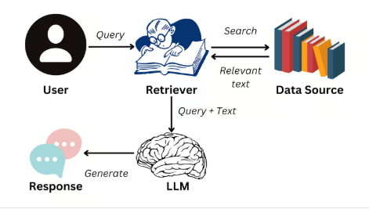
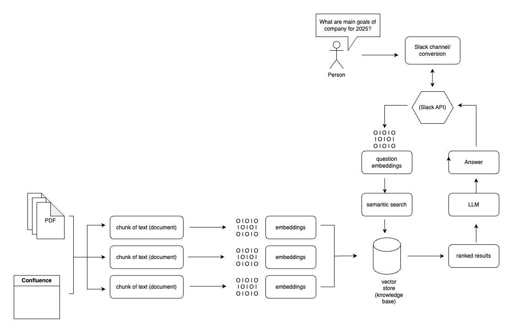
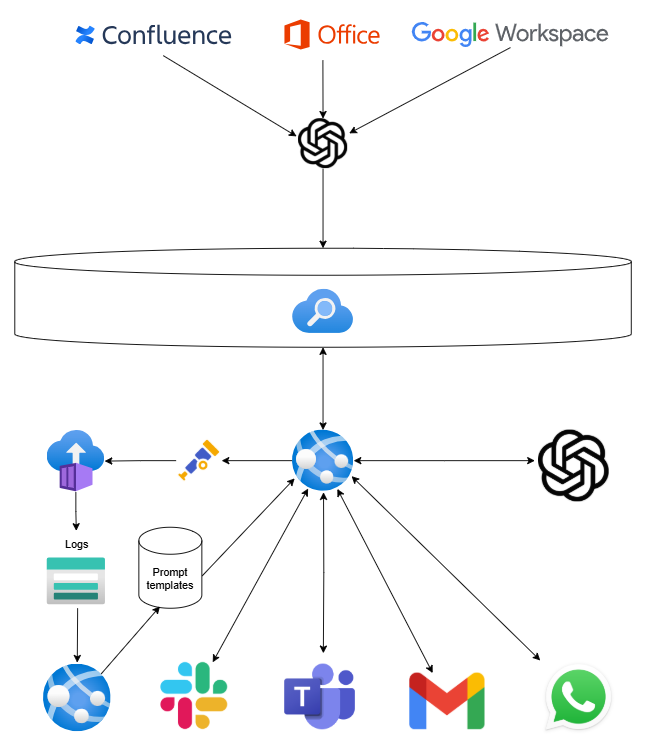

# Od Baiaji k Siesta AI

---

# Retrieval-Augmented Generation (RAG)

- Oddělení znalostí od modelu
- **R** - **retrieval**: vyhledání relevantních dokumentů (např. Azure AI Search, Pinecone, Weaviate, AstraDB)
- **A - augmentation**: doplnění promptu o nalezené dokumenty
- **G - generation**: generování odpovědi (LLM, např OpenAI ChatGPT - umí jazyk, zformuluje odpověď)
- Výhody: aktuální data, využití interních dat, přizpůsobitelnost
- Nezapomenout na **ingestion** - někde bokem, buď jednou, nebo periodicky = získání dokumentů, převod dokumentů na vektory, uložení do DBB

---

---

---

# Baiaia - interní chat Siesty na Slacku + různá dema

- Python + LangChain
- Flask API pro ingest dokumentů
- Faiss / in-memory vektorové úložiště
- OpenAI embeddings
- Chat v JS / Python

---

<!-- obrázek staré architektury -->

---

# Problémy do budoucna, cesta k Semantic Kernel
- V Siestě většina lidí zkušenější s C#
- Příliš mnoho komponent / služeb - více service planů, 
- Redukce Azure Service Plans (nižší provozní náklady) – Python nelze hostovat na Windows App Service
- Blbé například když bude malá C# aplikace která bude chtít využívat něco málo AI (malý chat, generování hlášky), muselo by vzniknout znovu v C# a nešlo by přepoužít
- Semantic Kernel (microsoft) - C# friendly, open-source, future-proof
- Zachování Python ingestion části jako Azure Function - není potřeba Service plan, je možné využít Consumption plan, ingestion se bude spouštět málo
---

# Co je Semantic Kernel?

- 🧠 Open-source orchestrátor pro LLM od Microsoftu
- ✨ Modularita: propojuje různé AI poskytovatele a datové zdroje
- 💬 Integrace do běžných aplikací v C#, Pythonu i Javě
- 🧩 Podpora "pluginového" stylu práce – jednotlivé funkce jako rozšiřitelné moduly
- 🧠 Vhodný pro enterprise aplikace i malé projekty

---

## Podporovaní AI poskytovatelé (LLM enginy)

- 🟢 **Azure OpenAI** – GPT-3.5 / GPT-4, řízení přes Azure Portal
- 🟢 **OpenAI API** – klasický OpenAI (s API klíčem)
- 🟡 **HuggingFace** – open-source modely (např. LLaMA, Falcon, Mistral…)
- 🟡 **Local models** – možnost připojit vlastní inference backend
- 🔌 Lze přidat **vlastního provider-a** (např. Ollama, Together.ai…)

---

## Funkce Semantic Kernelu

- 🧠 Paměť (Memory) – ukládání a dotazování na předchozí znalosti
- ⚙️ Plugins – vlastní funkce nebo napojení na API
- 🤖 Agents – autonomní plánování kroků a volání funkcí
- 🗂️ Přístup k souborům, webům, SQL, vyhledávání, atd.
- 🧩 Snadná kombinace s nástroji jako Azure AI Search, LangChain, Cognitive Search

---

## Odkazy

- Dokumentace: [learn.microsoft.com/semantic-kernel](https://learn.microsoft.com/semantic-kernel)
- GitHub: [github.com/microsoft/semantic-kernel](https://github.com/microsoft/semantic-kernel)

---

# Proč dává Semantic Kernel v C# smysl?

| Co potřebuju | Semantic Kernel |
|--------------|------------------|
| 🧱 Integrace do .NET monolitu | ✅ výborná |
| 🔁 Znovupoužitelnost v jiných .NET projektech | ✅ jednoduchá |
| 🔒 Autentizace, Azure služby, DevOps | ✅ standardní |
| 🧠 AI orchestrace, plánování, memory | ✅ podporováno |
| 🧪 Experimentální playground | ❌ horší než Python, ale ingestion oddělené |

---

# Nový návrh
-  LangChain zůstává pouze pro **stažení a parsing dokumentů** (PDF, Confluence, GitBook, jednoduché přidání dalšího zdroje z bohatého katalogu komunity)
-  Ukládání jednotných dokumentů do Blob Storage jako JSON 
    - :bulb: případné obohacení o vektory už teď
-  Azure AI Search indexer automaticky načítá data z Blob Storage 
   -  :bulb: případná vektorizace, zde ale potřeba Azure OpenAI
-  Semantic Kernel v C# používá dotazy nad vektorovým indexem
-  Celý "chat" běží v C# – výhoda pro integraci a údržbu

<!-- --- -->

<!-- obrázek nové architektury -->
<!--  -->

---

# Úvahy a rizika
- Azure AI Search - Azure native řešení, ale cena? Vyměnitelnost za běžné databáze? (Je to něco trochu jiného než tradiční vektorovka) 
- Azure OpenAI - totéž, pohodlné, lepší integrace, bezpečnost (např. pro Governance) ale prozkoumat pricing
- Organizace Blob storage - Měl by být každý dokument uložen jako samostatný JSON? (lepší granularita, reindexace)
- Ingest asi největši problém
    - Redundance
    - Jak často?
    - např. cena za vektorizaci v LangChainu (OpenAI embeddings) – nutnost cache?

---

# Plán - vznik Siesta AI knihovny (knihoven?), přepoužitelný základ

- ✅ Nová AI logika poběží plně v .NET (Semantic Kernel)
- ✅ Lze snadno **přidat do nových a existujících C# projektů**
- ✅ Bez potřeby nasazení Python infrastruktury
- 📦 Např. NuGet balíček = jednotný způsob dotazování AI napříč firmou
- 📉 Nižší nároky na DevOps a provoz

---

# Shrnutí

✅ LangChain použit jen tam, kde exceluje (data ingestion)  
✅ Azure AI Search = Azure native řešení pro RAG
✅ Semantic Kernel jako hlavní orchestrátor pro větší projekty 
✅ C# projekt zůstává monolitický, dobře integrovatelný  